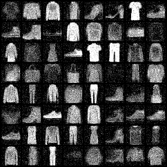
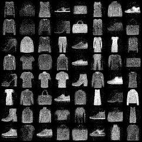
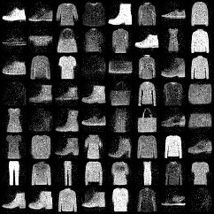
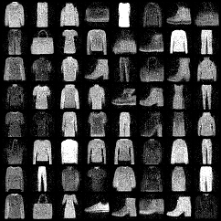

Pytorch Implementation of Glow in PyTorch. Based on the paper:

  > [NICE: Non-linear Independent Components Estimation](https://arxiv.org/abs/1410.8516)\
  > Laurent Dinh, David Krueger, Yoshua Bengio\
  > arXiv:1410.8516

Final samples can be found in the `new_samples` folder.

## MNIST
### Epoch 1000

### Epoch 10000

### Epoch 20000

### Epoch 50000

## FAHSION_MNIST

### Epoch 1000

### Epoch 10000

### Epoch 20000

### Epoch 50000

## Usage
The entire code is self contained in the Jupyter notebook,just run the cells sequentially. It is made this way for ease of training on Google Colab.